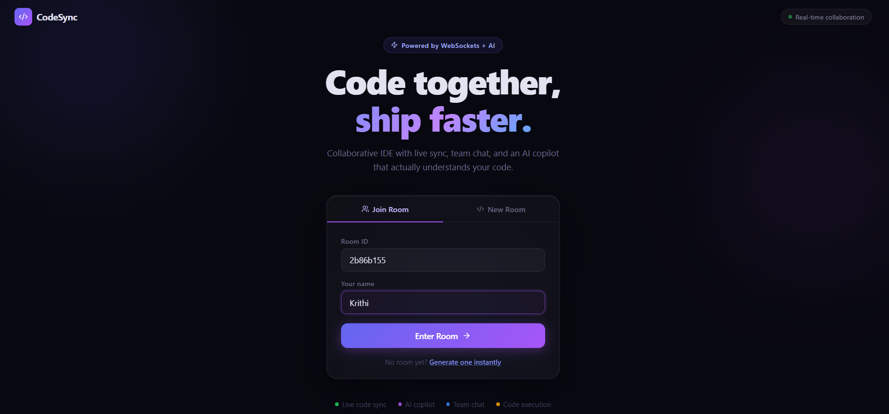
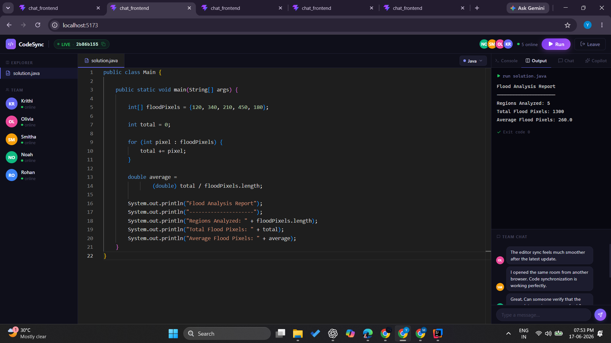
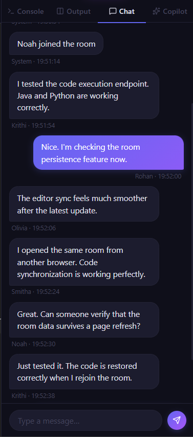

# CodeSync

CodeSync is a real-time collaborative coding platform that allows multiple users to work in the same coding room, communicate through integrated chat, execute code, and receive AI-powered assistance while programming.

The project was built to explore distributed collaboration systems using WebSockets and modern full-stack technologies. It combines real-time synchronization, code execution, AI integration, and persistent storage into a single platform.

## Screenshots

### Landing Page


### Collaborative Editor


### Realtime Chats



## Features

### Real-Time Collaboration

* Live code synchronization across connected users
* Shared programming rooms
* Multi-user presence tracking
* Instant updates using WebSockets

### Code Execution

* Execute code directly from the editor
* Supports multiple programming languages
* Powered by Judge0 API
* Console and output views

### AI Copilot

* Explain code
* Find potential bugs
* Suggest optimizations
* Generate test cases
* Integrated using Gemini API

### Team Communication

* Built-in room chat
* User join/leave notifications
* Online participant tracking

### Persistence

* Room state stored in PostgreSQL
* Code and language selection preserved
* Automatic room updates during collaboration

---

## Architecture

Frontend (React + Vite)

↓ WebSocket / REST API

Backend (Spring Boot)

↓

* PostgreSQL (Room Persistence)
* Gemini API (AI Assistance)
* Judge0 API (Code Execution)

---

## Tech Stack

### Frontend

* React
* Vite
* Monaco Editor
* STOMP.js
* SockJS
* CSS

### Backend

* Spring Boot
* Spring WebSocket
* Spring Data JPA
* Hibernate

### Database

* PostgreSQL

### External Services

* Judge0 API
* Gemini API

---

## Project Structure

```text
CodeSync
├── frontend
│   ├── src
│   ├── public
│   └── package.json
│
├── backend
│   ├── src
│   ├── pom.xml
│   └── application.properties
│
└── README.md
```

## Running Locally

### Backend

```bash
cd backend
mvn spring-boot:run
```

### Frontend

```bash
cd frontend
npm install
npm run dev
```

The frontend runs on:

```text
http://localhost:5173
```

The backend runs on:

```text
http://localhost:8080
```

---

## Future Improvements

* Cursor presence and live cursor tracking
* File management system
* Authentication and user accounts
* Room ownership and permissions
* Docker deployment
* Collaborative whiteboard
* Version history and code snapshots

---

## Motivation

Most collaborative editors focus either on code execution or communication. CodeSync was built to combine collaboration, execution, AI assistance, and persistence into a single development environment while providing hands-on experience with WebSockets, distributed state synchronization, and full-stack application development.
